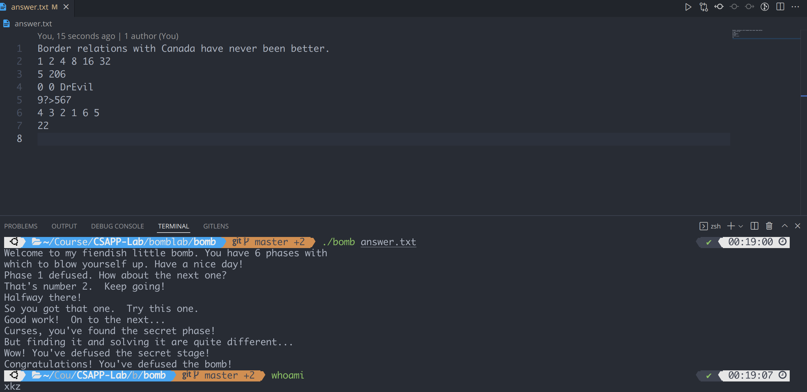

# Bomb Lab Report

## 上手

一开始拿到代码后, 先看 `bomb.c` 文件, 得知题目要求是进行 6 轮输入, 每轮输入正确则进入下一轮, 否则炸弹将爆炸. 接下来试运行 `bomb`, 发现确实如此, 用 gdb 检查 `bomb`, 发现源文件和 `bomb.c` 是完全一样的:


此外, 可以将之前的正确输入存到文件里, 作为运行 `bomb` 的第一个参数.

从源代码中可以看出, 具体每个 Phase 的细节被隐藏在了引用的头文件里, 尝试用 objdump 进行反汇编:

```shell
$ objdump -d bomb > bomb.asm
```

查看 `bomb.asm` 文件, `.text` 段内包含我们的每个 Phase 函数, 下面逐一破解.

## Phase 1

反汇编后得到的代码:

```assembly
0000000000400ee0 <phase_1>:
  400ee0:	48 83 ec 08          	sub    $0x8,%rsp
  400ee4:	be 00 24 40 00       	mov    $0x402400,%esi
  400ee9:	e8 4a 04 00 00       	callq  401338 <strings_not_equal>
  400eee:	85 c0                	test   %eax,%eax
  400ef0:	74 05                	je     400ef7 <phase_1+0x17>
  400ef2:	e8 43 05 00 00       	callq  40143a <explode_bomb>
  400ef7:	48 83 c4 08          	add    $0x8,%rsp
  400efb:	c3                   	retq  
```

观察到其调用了 `strings_not_equal` 函数, 猜测其作用是判断传入的两个字符串是否相等, 如果相等返回 0, 而后面 `test` 测试 `rax` 寄存器是否为 0, 如果不是就会爆炸, 而另一个比较的字符串存在 0

402400 处, 用 gdb 可以得知此处的数据为 "Border relations with Canada have never been better."

尝试输入正确.


之后将其存入同目录下名为 `answer.txt` 的文件 (注意文件最后需要有一行空行).

## Phase 2

反汇编代码:

```assembly
0000000000400efc <phase_2>:
  400efc:	55                   	push   %rbp
  400efd:	53                   	push   %rbx
  400efe:	48 83 ec 28          	sub    $0x28,%rsp # allocate 0x28 bytes
  400f02:	48 89 e6             	mov    %rsp,%rsi # rsi = rsp
  400f05:	e8 52 05 00 00       	callq  40145c <read_six_numbers> # rdi = input
  400f0a:	83 3c 24 01          	cmpl   $0x1,(%rsp)
  400f0e:	74 20                	je     400f30 <phase_2+0x34> # *rsp != 0x1, explode
  400f10:	e8 25 05 00 00       	callq  40143a <explode_bomb>
  400f15:	eb 19                	jmp    400f30 <phase_2+0x34>
  400f17:	8b 43 fc             	mov    -0x4(%rbx),%eax # eax = *(rbx - 0x4)
  400f1a:	01 c0                	add    %eax,%eax # eax *= 2
  400f1c:	39 03                	cmp    %eax,(%rbx)
  400f1e:	74 05                	je     400f25 <phase_2+0x29> # if *rbx != eax, explode
  400f20:	e8 15 05 00 00       	callq  40143a <explode_bomb>
  400f25:	48 83 c3 04          	add    $0x4,%rbx # rbx += 4
  400f29:	48 39 eb             	cmp    %rbp,%rbx # rbx:rbp
  400f2c:	75 e9                	jne    400f17 <phase_2+0x1b>
  400f2e:	eb 0c                	jmp    400f3c <phase_2+0x40>
  400f30:	48 8d 5c 24 04       	lea    0x4(%rsp),%rbx # rbx = rsp + 0x4
  400f35:	48 8d 6c 24 18       	lea    0x18(%rsp),%rbp # rbp = rsp + 0x18
  400f3a:	eb db                	jmp    400f17 <phase_2+0x1b>
  400f3c:	48 83 c4 28          	add    $0x28,%rsp
  400f40:	5b                   	pop    %rbx
  400f41:	5d                   	pop    %rbp
  400f42:	c3                   	retq
```

观察到一开始分配了 0x28 (40) 个字节, 然后调用 `read_six_numbers`, 其反汇编代码如下:

```assembly
000000000040145c <read_six_numbers>: # rdi = input, rsi = rsp
  40145c:	48 83 ec 18          	sub    $0x18,%rsp # allocate 0x18 bytes
  401460:	48 89 f2             	mov    %rsi,%rdx # rdx = rsi
  401463:	48 8d 4e 04          	lea    0x4(%rsi),%rcx # rcx = 4 + rsi
  401467:	48 8d 46 14          	lea    0x14(%rsi),%rax # rax = 24 + rsi
  40146b:	48 89 44 24 08       	mov    %rax,0x8(%rsp) # *(0x8 + rsp) = rax = 20 + rsi
  401470:	48 8d 46 10          	lea    0x10(%rsi),%rax # rax = 16 + rsi
  401474:	48 89 04 24          	mov    %rax,(%rsp) # *rsp = rax
  401478:	4c 8d 4e 0c          	lea    0xc(%rsi),%r9 # r9 = rsi + 14
  40147c:	4c 8d 46 08          	lea    0x8(%rsi),%r8 # r8 = rsi + 8
  401480:	be c3 25 40 00       	mov    $0x4025c3,%esi # esi = 0x4025c3
  401485:	b8 00 00 00 00       	mov    $0x0,%eax # eax = 0
  40148a:	e8 61 f7 ff ff       	callq  400bf0 <__isoc99_sscanf@plt>
  40148f:	83 f8 05             	cmp    $0x5,%eax # eax:5
  401492:	7f 05                	jg     401499 <read_six_numbers+0x3d>
  401494:	e8 a1 ff ff ff       	callq  40143a <explode_bomb>
  401499:	48 83 c4 18          	add    $0x18,%rsp
  40149d:	c3                   	retq  
```

一开始分配 0x18 个字节, 刚好就是 6 个 int 类型的大小, 然后 `rdi` 是 `read_line` 读进来的 `input` 字符串, `rsi` 作为第二个参数记录了原本分配了 40 个字节后栈指针的位置, 注意到之后调用 `sscanf`, 并检查返回值是否大于 5, 说明是从 `rdi` 里读进来了 6 个整数, 不足 6 个将爆炸, 而这 6 个整数恰好存在 `rsi`, `rcx` 等参数是读取后存储的地址, 指向的地址恰好是公差为 4 的等差数列, 起点是一开始的 `rsp`, 说明该函数返回后 6 个整数按照地址从低到高的顺序存在栈里.

之后就判断这 6 个数是什么, 在调用完 `read_six_numbers` 后, 400f0e 处说明第一个数是 1, 然后进行初始化:

`rbx = rsp + 0x4`, `rbp = rsp + 0x18`, `rbp` 就指向了比较的终点, `rbx` 指向比较对象, 之后进入循环, 循环在 `rbx` 大于 `rbp` 后退出.

每次循环用 `eax` 取出前一个数, 然后乘二, 看是不是与当前数相等, 不是就爆炸, 说明输入的六个整数是等比数列: "1 2 4 8 16 32". (注意应该用空格分割, 因为是用 `sscanf` 读取)

## Phase 3

反汇编代码:

```assembly
0000000000400f43 <phase_3>:
  400f43:	48 83 ec 18          	sub    $0x18,%rsp
  400f47:	48 8d 4c 24 0c       	lea    0xc(%rsp),%rcx # rcx = rsp + 12, 4th arg
  400f4c:	48 8d 54 24 08       	lea    0x8(%rsp),%rdx # rdx = rsp + 8, 3rd arg
  400f51:	be cf 25 40 00       	mov    $0x4025cf,%esi # esi = 0x4025cf, 2nd arg
  400f56:	b8 00 00 00 00       	mov    $0x0,%eax # eax = 0
  400f5b:	e8 90 fc ff ff       	callq  400bf0 <__isoc99_sscanf@plt>
  400f60:	83 f8 01             	cmp    $0x1,%eax
  400f63:	7f 05                	jg     400f6a <phase_3+0x27> # skip next
  400f65:	e8 d0 04 00 00       	callq  40143a <explode_bomb>
  400f6a:	83 7c 24 08 07       	cmpl   $0x7,0x8(%rsp) # *(rsp + 8):7
  400f6f:	77 3c                	ja     400fad <phase_3+0x6a>
  400f71:	8b 44 24 08          	mov    0x8(%rsp),%eax # eax = 3rd arg
  400f75:	ff 24 c5 70 24 40 00 	jmpq   *0x402470(,%rax,8) # goto *(0x402470 + rax * 8)
  400f7c:	b8 cf 00 00 00       	mov    $0xcf,%eax
  400f81:	eb 3b                	jmp    400fbe <phase_3+0x7b>
  400f83:	b8 c3 02 00 00       	mov    $0x2c3,%eax
  400f88:	eb 34                	jmp    400fbe <phase_3+0x7b>
  400f8a:	b8 00 01 00 00       	mov    $0x100,%eax
  400f8f:	eb 2d                	jmp    400fbe <phase_3+0x7b>
  400f91:	b8 85 01 00 00       	mov    $0x185,%eax
  400f96:	eb 26                	jmp    400fbe <phase_3+0x7b>
  400f98:	b8 ce 00 00 00       	mov    $0xce,%eax
  400f9d:	eb 1f                	jmp    400fbe <phase_3+0x7b>
  400f9f:	b8 aa 02 00 00       	mov    $0x2aa,%eax
  400fa4:	eb 18                	jmp    400fbe <phase_3+0x7b>
  400fa6:	b8 47 01 00 00       	mov    $0x147,%eax
  400fab:	eb 11                	jmp    400fbe <phase_3+0x7b>
  400fad:	e8 88 04 00 00       	callq  40143a <explode_bomb>
  400fb2:	b8 00 00 00 00       	mov    $0x0,%eax
  400fb7:	eb 05                	jmp    400fbe <phase_3+0x7b>
  400fb9:	b8 37 01 00 00       	mov    $0x137,%eax
  400fbe:	3b 44 24 0c          	cmp    0xc(%rsp),%eax # eax:4th arg
  400fc2:	74 05                	je     400fc9 <phase_3+0x86> # if equal skip next
  400fc4:	e8 71 04 00 00       	callq  40143a <explode_bomb>
  400fc9:	48 83 c4 18          	add    $0x18,%rsp
  400fcd:	c3                   	retq  
```

一开始调用 `sscanf`, 第二个参数是一个奇怪的地址, 猜测应该不是为了存储读入的数, 否则后面判断返回值应该是要比 2 大. 因此这个参数应该是格式控制符, 用 gdb 查看:

```shell
(gdb) x/s 0x4025cf
0x4025cf:       "%d %d"
```

说明读入两个整数, 之后由 400f6a 和 400f6f 可知, 第一个参数 (存在 rax 中) 介于 0 到 7 之间, 然后要根据它的值进行跳转, 由于地址 0x402470 已结超出了该函数的范围, 猜测那里存储着能够跳转回来的地址, 用 gdb 查看:

```shell
(gdb) x/8a 0x402470
0x402470:       0x400f7c <phase_3+57>   0x400fb9 <phase_3+118>
0x402480:       0x400f83 <phase_3+64>   0x400f8a <phase_3+71>
0x402490:       0x400f91 <phase_3+78>   0x400f98 <phase_3+85>
0x4024a0:       0x400f9f <phase_3+92>   0x400fa6 <phase_3+99>
```

可以发现它们分别对应 phase_3 里的一个 `mov` 指令, 每个 `mov` 后都跳到 400fbe 比较 `eax` 和读进来的第二个整数的值, 说明第二个整数跟第一个整数应该是配套的, 本问共有 8 组合理的解, 分别是

"0 207"
"1 311"
"2 707"
"3 256"
"4 389"
"5 206"
"6 682"
"7 327"

## Phase 4

反汇编代码:

```assembly
000000000040100c <phase_4>:
  40100c:	48 83 ec 18          	sub    $0x18,%rsp
  401010:	48 8d 4c 24 0c       	lea    0xc(%rsp),%rcx # denote as y
  401015:	48 8d 54 24 08       	lea    0x8(%rsp),%rdx # denote as x
  40101a:	be cf 25 40 00       	mov    $0x4025cf,%esi
  40101f:	b8 00 00 00 00       	mov    $0x0,%eax
  401024:	e8 c7 fb ff ff       	callq  400bf0 <__isoc99_sscanf@plt>
  401029:	83 f8 02             	cmp    $0x2,%eax
  40102c:	75 07                	jne    401035 <phase_4+0x29>
  # same as phase3 above
  40102e:	83 7c 24 08 0e       	cmpl   $0xe,0x8(%rsp) # 0 <= x <= 14
  401033:	76 05                	jbe    40103a <phase_4+0x2e>
  401035:	e8 00 04 00 00       	callq  40143a <explode_bomb>
  40103a:	ba 0e 00 00 00       	mov    $0xe,%edx
  40103f:	be 00 00 00 00       	mov    $0x0,%esi
  401044:	8b 7c 24 08          	mov    0x8(%rsp),%edi
  401048:	e8 81 ff ff ff       	callq  400fce <func4>
  40104d:	85 c0                	test   %eax,%eax # func4 should return 0
  40104f:	75 07                	jne    401058 <phase_4+0x4c>
  401051:	83 7c 24 0c 00       	cmpl   $0x0,0xc(%rsp)
  401056:	74 05                	je     40105d <phase_4+0x51> # y should be 0
  401058:	e8 dd 03 00 00       	callq  40143a <explode_bomb>
  40105d:	48 83 c4 18          	add    $0x18,%rsp
  401061:	c3                   	retq
```

可以发现 Phase 4 前面的代码跟 Phase 3 是一样的, 读入两个整数, 依次记作 `x` 和 `y`. 为了不爆炸, 需要调用 `func4` 后返回 0, 并且地址 `rsp + 12` 处 (读进来的第二个整数) 是 0. 注意到 `func4` 并未改变这个地方的值, 所以 `y` 是 0. 下面只要看 `x` 是多少能让 `func4` 返回 0.

`func4` 的代码如下:

```assembly
0000000000400fce <func4>:
  400fce:	48 83 ec 08          	sub    $0x8,%rsp
  400fd2:	89 d0                	mov    %edx,%eax # eax = edx
  400fd4:	29 f0                	sub    %esi,%eax # eax -= esi
  400fd6:	89 c1                	mov    %eax,%ecx # ecx = eax
  400fd8:	c1 e9 1f             	shr    $0x1f,%ecx # ecx >>= 31
  400fdb:	01 c8                	add    %ecx,%eax # eax += rcx
  400fdd:	d1 f8                	sar    %eax # eax >>= 1
  400fdf:	8d 0c 30             	lea    (%rax,%rsi,1),%ecx # ecx = rax + rsi
  400fe2:	39 f9                	cmp    %edi,%ecx
  400fe4:	7e 0c                	jle    400ff2 <func4+0x24>
  400fe6:	8d 51 ff             	lea    -0x1(%rcx),%edx # edx = rcx - 1
  400fe9:	e8 e0 ff ff ff       	callq  400fce <func4>
  400fee:	01 c0                	add    %eax,%eax
  400ff0:	eb 15                	jmp    401007 <func4+0x39>
  400ff2:	b8 00 00 00 00       	mov    $0x0,%eax
  400ff7:	39 f9                	cmp    %edi,%ecx
  400ff9:	7d 0c                	jge    401007 <func4+0x39>
  400ffb:	8d 71 01             	lea    0x1(%rcx),%esi
  400ffe:	e8 cb ff ff ff       	callq  400fce <func4>
  401003:	8d 44 00 01          	lea    0x1(%rax,%rax,1),%eax
  401007:	48 83 c4 08          	add    $0x8,%rsp
  40100b:	c3                   	retq
```

可以发现 `func4` 是一个递归函数, 一开始输入的值为: `edx = 14`, `esi = 0`, `edi = x`.

函数的逻辑比较复杂, 我们重点关注修改了函数返回值的部分. 可以发现, 400ff2 处直接将其设置为 0, 而该地址恰好是前半段递归在 400fe4 处跳出后到达的地址, 跳出的条件是 `ecx <= edi`, 而随后便是判断 `ecx >= edi` 时函数退栈并返回, 中途 `ecx` 和 `edi` 都没有改变, 那么我们只要取巧让 `edi` 取值为函数第一遍调用时 `ecx` 的值即可. 其值为 `(14 - 0) >> 31 + (14 >> 1) = 7`, 因此本题答案可以取 "7 0".

事实上, 如果不让函数第一次调用时就退出, 而是让函数进行递归, 最终递归出来后, 只要返回的是 0, 在 `eax += eax` 后就退出了, 因此还会一层一层地返回 0 并退栈, 因此 `x` 可以取任意一层递归中 `ecx` 的值:

| 递归调用层数 | ecx 的值 |
| :----------: | :------: |
|      0       |    7     |
|      1       |    3     |
|      2       |    1     |
|      3       |    0     |

## Phase 5

反汇编代码:

```assembly
0000000000401062 <phase_5>:
  401062:	53                   	push   %rbx
  401063:	48 83 ec 20          	sub    $0x20,%rsp # allocate 32 bytes
  401067:	48 89 fb             	mov    %rdi,%rbx # rbx = rdi
  40106a:	64 48 8b 04 25 28 00 	mov    %fs:0x28,%rax
  401071:	00 00 
  401073:	48 89 44 24 18       	mov    %rax,0x18(%rsp) # *(rsp + 24) = rax
  401078:	31 c0                	xor    %eax,%eax # eax = 0
  40107a:	e8 9c 02 00 00       	callq  40131b <string_length>
  40107f:	83 f8 06             	cmp    $0x6,%eax # input is a string of length 6
  401082:	74 4e                	je     4010d2 <phase_5+0x70>
  401084:	e8 b1 03 00 00       	callq  40143a <explode_bomb>
  401089:	eb 47                	jmp    4010d2 <phase_5+0x70>
  40108b:	0f b6 0c 03          	movzbl (%rbx,%rax,1),%ecx # ecx = *(rbx + rax)
  40108f:	88 0c 24             	mov    %cl,(%rsp) # *rsp = cl
  401092:	48 8b 14 24          	mov    (%rsp),%rdx # rdx = *rsp
  401096:	83 e2 0f             	and    $0xf,%edx # edx &= 0xf
  401099:	0f b6 92 b0 24 40 00 	movzbl 0x4024b0(%rdx),%edx # edx = *(rdx + 0x4024b0)
  4010a0:	88 54 04 10          	mov    %dl,0x10(%rsp,%rax,1) # *(rsp + rax + 16) = dl
  4010a4:	48 83 c0 01          	add    $0x1,%rax # rax += 1
  4010a8:	48 83 f8 06          	cmp    $0x6,%rax # rax:6
  4010ac:	75 dd                	jne    40108b <phase_5+0x29>
  4010ae:	c6 44 24 16 00       	movb   $0x0,0x16(%rsp) # *(rsp + 24) = 0
  4010b3:	be 5e 24 40 00       	mov    $0x40245e,%esi # rsi = 0x40245e
  4010b8:	48 8d 7c 24 10       	lea    0x10(%rsp),%rdi # rdi = rsp + 16
  4010bd:	e8 76 02 00 00       	callq  401338 <strings_not_equal>
  4010c2:	85 c0                	test   %eax,%eax
  4010c4:	74 13                	je     4010d9 <phase_5+0x77>
  4010c6:	e8 6f 03 00 00       	callq  40143a <explode_bomb>
  4010cb:	0f 1f 44 00 00       	nopl   0x0(%rax,%rax,1)
  4010d0:	eb 07                	jmp    4010d9 <phase_5+0x77>
  4010d2:	b8 00 00 00 00       	mov    $0x0,%eax
  4010d7:	eb b2                	jmp    40108b <phase_5+0x29>
  4010d9:	48 8b 44 24 18       	mov    0x18(%rsp),%rax # rax = *(rsp + 24)
  4010de:	64 48 33 04 25 28 00 	xor    %fs:0x28,%rax
  4010e5:	00 00 
  4010e7:	74 05                	je     4010ee <phase_5+0x8c>
  4010e9:	e8 42 fa ff ff       	callq  400b30 <__stack_chk_fail@plt>
  4010ee:	48 83 c4 20          	add    $0x20,%rsp
  4010f2:	5b                   	pop    %rbx
  4010f3:	c3                   	retq
```

40107f 处说明输入是一个长度为 6 的字符串, 检查完字符串长度后 40108b 到 4010a8 是一个循环, `rax` 从 0 开始每次加一, 一直到变成 6 时循环退出. 注意到 `rbx` 一开始被赋值为 `rdi`, 因此每次用 `cl` 指向字符串里的一个字符, 存在 `rsp` 所在的位置, 之后用该字符的后 4 bit 作为偏移量, 加到 0x4024b0, 取出这个地址的数, 将最低位字节存到 `rsp + rax + 16`, 这样又构成一个字符串, 用 `rdi` 指向它, 比较其与 0x40245e 处的字符串是不是相同, 不相同将会爆炸.

用 gdb 查看 0x40245e 处字符串:

```shell
(gdb) x/s 0x40245e
0x40245e:       "flyers"
```

那么我们只要从 0x4024b0 后面挑出这些字符就可以了:

```shell
(gdb) x/s 0x4024b0
0x4024b0 <array.3449>:  "maduiersnfotvbylSo you think you can stop the bomb with ctrl-c, do you?"
```

分别看每个字符的偏移量:

| 字符 | 偏移 | 偏移量作为字符的后 4 bit 对应回的原字符 |
| :--: | :--: | :-------------------------------------: |
|  f   | 0x9  |                    9                    |
|  l   | 0xf  |                    ?                    |
|  y   | 0xe  |                    >                    |
|  e   | 0x5  |                    5                    |
|  r   | 0x6  |                    6                    |
|  s   | 0x7  |                    7                    |

答案为 "9?>567" (显然本题可能有很多解).

注意到 40106a 处用到了 `%fs:0x28`, 这是用于检查是否发生了栈溢出, 一开始将它的值存到 `rax` 中, 之后再比较其值是否被修改, 如果被修改就调用 `__stack_chk_fail` 函数, 表明发生了栈溢出.

## Phase 6

反汇编代码极长:

```assembly
00000000004010f4 <phase_6>:
  4010f4:	41 56                	push   %r14
  4010f6:	41 55                	push   %r13
  4010f8:	41 54                	push   %r12
  4010fa:	55                   	push   %rbp
  4010fb:	53                   	push   %rbx
  
  # read
  4010fc:	48 83 ec 50          	sub    $0x50,%rsp # allocate 80 bytes
  401100:	49 89 e5             	mov    %rsp,%r13 # r13 = rsp
  401103:	48 89 e6             	mov    %rsp,%rsi # rsi = rsp
  401106:	e8 51 03 00 00       	callq  40145c <read_six_numbers> # six item array, denote as a
  40110b:	49 89 e6             	mov    %rsp,%r14 # r14 = rsp
  40110e:	41 bc 00 00 00 00    	mov    $0x0,%r12d # r12d = 0
  
  # outer
  401114:	4c 89 ed             	mov    %r13,%rbp # rbp = r13
  401117:	41 8b 45 00          	mov    0x0(%r13),%eax # eax = *r13 = a[r12d]
  40111b:	83 e8 01             	sub    $0x1,%eax # eax--
  40111e:	83 f8 05             	cmp    $0x5,%eax # eax:5
  # every item in a is between 1 and 6
  401121:	76 05                	jbe    401128 <phase_6+0x34>
  # 0 <= eax <= 5, skip next
  401123:	e8 12 03 00 00       	callq  40143a <explode_bomb>
  401128:	41 83 c4 01          	add    $0x1,%r12d # r12d++
  40112c:	41 83 fc 06          	cmp    $0x6,%r12d # r12d:6
  401130:	74 21                	je     401153 <phase_6+0x5f> # r12d == 6, break outer
  401132:	44 89 e3             	mov    %r12d,%ebx # ebx = r12d
  
  # inner, ensures that the rest items in the array != r12dth item
  401135:	48 63 c3             	movslq %ebx,%rax
  401138:	8b 04 84             	mov    (%rsp,%rax,4),%eax # eax = *(rsp + 4 * rax) = a[rax]
  40113b:	39 45 00             	cmp    %eax,0x0(%rbp)
  40113e:	75 05                	jne    401145 <phase_6+0x51> # *rbp != eax, skip next
  401140:	e8 f5 02 00 00       	callq  40143a <explode_bomb>
  401145:	83 c3 01             	add    $0x1,%ebx # ebx++
  401148:	83 fb 05             	cmp    $0x5,%ebx # ebx:5
  40114b:	7e e8                	jle    401135 <phase_6+0x41> # inner
  40114d:	49 83 c5 04          	add    $0x4,%r13 # r13 += 4
  401151:	eb c1                	jmp    401114 <phase_6+0x20> # outer
  
  401153:	48 8d 74 24 18       	lea    0x18(%rsp),%rsi # rsi = rsp + 24
  401158:	4c 89 f0             	mov    %r14,%rax # rax = r14 = rsp
  40115b:	b9 07 00 00 00       	mov    $0x7,%ecx # ecx = 7
  
  # loop, for i in range(0, 6): a[i] = 7 - a[i] 
  401160:	89 ca                	mov    %ecx,%edx # edx = ecx = 7
  401162:	2b 10                	sub    (%rax),%edx # edx -= *rax
  401164:	89 10                	mov    %edx,(%rax) # *rax = edx
  401166:	48 83 c0 04          	add    $0x4,%rax # rax += 4
  40116a:	48 39 f0             	cmp    %rsi,%rax # rax:rsi
  40116d:	75 f1                	jne    401160 <phase_6+0x6c> # loop
  
  40116f:	be 00 00 00 00       	mov    $0x0,%esi # esi = 0
  401174:	eb 21                	jmp    401197 <phase_6+0xa3> # to label
  
  # outer, write 6 long int to array b start at address (rsp + 2 * rsi + 32)
  # b[i] = 0x6032d0 + a[i] * 0x10
  401176:	48 8b 52 08          	mov    0x8(%rdx),%rdx # rdx = *(rdx + 8)
  40117a:	83 c0 01             	add    $0x1,%eax # eax++
  40117d:	39 c8                	cmp    %ecx,%eax # eax:ecx
  40117f:	75 f5                	jne    401176 <phase_6+0x82> # outer
  
  401181:	eb 05                	jmp    401188 <phase_6+0x94> # skip next
  
  # inner
  401183:	ba d0 32 60 00       	mov    $0x6032d0,%edx # edx = 0x6032d0
  401188:	48 89 54 74 20       	mov    %rdx,0x20(%rsp,%rsi,2) # *(rsp + 2 * rsi + 32) = rdx
  40118d:	48 83 c6 04          	add    $0x4,%rsi # rsi += 4
  401191:	48 83 fe 18          	cmp    $0x18,%rsi # rsi:24
  401195:	74 14                	je     4011ab <phase_6+0xb7> # if rsi = 24, break
  
  # label
  401197:	8b 0c 34             	mov    (%rsp,%rsi,1),%ecx # ecx = *(rsp + rsi)
  40119a:	83 f9 01             	cmp    $0x1,%ecx # ecx:1
  40119d:	7e e4                	jle    401183 <phase_6+0x8f> # if ecx == 1, inner
  40119f:	b8 01 00 00 00       	mov    $0x1,%eax # eax = 1
  4011a4:	ba d0 32 60 00       	mov    $0x6032d0,%edx # edx = 0x6032d0
  4011a9:	eb cb                	jmp    401176 <phase_6+0x82> # outer
  
  # for j in range(1, 6):
  # 	*(b[j - 1] + 8) = b[j]
  4011ab:	48 8b 5c 24 20       	mov    0x20(%rsp),%rbx # rbx = *(rsp + 32) = b[0]
  4011b0:	48 8d 44 24 28       	lea    0x28(%rsp),%rax # rax = rsp + 40, points to b[1]
  4011b5:	48 8d 74 24 50       	lea    0x50(%rsp),%rsi # rsi = rsp + 80, end
  4011ba:	48 89 d9             	mov    %rbx,%rcx # rcx = rbx
  4011bd:	48 8b 10             	mov    (%rax),%rdx # rdx = *(rax) = b[j]
  4011c0:	48 89 51 08          	mov    %rdx,0x8(%rcx) # *(rcx + 8) = rdx
  4011c4:	48 83 c0 08          	add    $0x8,%rax # rax += 8
  4011c8:	48 39 f0             	cmp    %rsi,%rax # rax:rsi
  4011cb:	74 05                	je     4011d2 <phase_6+0xde> 
  4011cd:	48 89 d1             	mov    %rdx,%rcx # rcx = rdx
  4011d0:	eb eb                	jmp    4011bd <phase_6+0xc9>
  
  4011d2:	48 c7 42 08 00 00 00 	movq   $0x0,0x8(%rdx) # *(rdx + 8) = 0
  4011d9:	00 
  
  
  4011da:	bd 05 00 00 00       	mov    $0x5,%ebp # ebp = 5
  
  # loop
  4011df:	48 8b 43 08          	mov    0x8(%rbx),%rax # rax = *(rbx + 8)
  4011e3:	8b 00                	mov    (%rax),%eax # eax = *rax
  4011e5:	39 03                	cmp    %eax,(%rbx) # *rbx:eax
  4011e7:	7d 05                	jge    4011ee <phase_6+0xfa> # *rbx>=eax, skip next
  4011e9:	e8 4c 02 00 00       	callq  40143a <explode_bomb>
  4011ee:	48 8b 5b 08          	mov    0x8(%rbx),%rbx # rbx = *(rbx + 8)
  4011f2:	83 ed 01             	sub    $0x1,%ebp # ebp--
  4011f5:	75 e8                	jne    4011df <phase_6+0xeb> # ebp != 0 loop
  
  4011f7:	48 83 c4 50          	add    $0x50,%rsp
  4011fb:	5b                   	pop    %rbx
  4011fc:	5d                   	pop    %rbp
  4011fd:	41 5c                	pop    %r12
  4011ff:	41 5d                	pop    %r13
  401201:	41 5e                	pop    %r14
  401203:	c3                   	retq
```

我们将代码拆成几块来分析:

### 读取

4010fc 到 40110e 进行的是读取, 本题的答案应该是 6 个 int 类型的整数. 读进来以后存在栈里, 我们不妨将这 6 个整数组成的数组记作 `a`.

### 数组元素是 1 到 6 的排列

401114 到 4011a9 我们从 40114b 和 401151 可以看出是两重循环的嵌套, 不妨将外层记作 outer, 内层记作 inner.

外层循环中, `r12d` 充当计数器, 从 0 开始, 每次加 1, 到 6 退出. 然后通过 `eax` 索引出 `a[r12d]`, 判断其是否在 1 到 6 之间, 如果不是将爆炸. 说明 `1<= a[i] <= 6, i in range(6)`.

之后进入内层循环, 内层循环遍历 `r12d` 后数组中的每个数, 如果有一个等于 `a[r12d]` 就爆炸. 这说明数组里的每个元素都相等.

这段可以用高级语言代码表示:

```c
for (int i = 0; i < 6; ++i) {
    if (a[i] < 0 | a[i] >= 7) {
        explode();
    }     
    for (int j = i + 1; j < 6; ++j) {
        if (a[j] == a[i]) {
            explode();
        }            
    }
}
```

说明数组元素是 1 到 6 的排列.

### 遍历数组, 修改元素

401160 到 40116d 遍历了数组, 将每个元素 x 修改为 7 - x, 可以写作高级语言代码:

```c
for (int i = 0; i < 6; ++i) {
    a[i] = 7 - a[i];
}
```

### 通过数组 a 创建另一个数组 b

上面的修改结束后, 首先进行了初始化, `rsi` 被用作指针指向数组元素. 同时判断 `ecx` 是否为 1, 是就执行内层循环, 否则将 eax 设为 1 执行外层代码后再进入内层循环.

401176 到 4011a9是这两层循环, 发现外层所做的事无非是更新了 `rdx` 的值, 而内层是为了将地址 `rsp + 2 * rsi + 32` 处的值设为 `rdx`. 而 `rdx` 的值似乎与 `0x6032d0` 这个地址的值脱不开关系, 我们用 gdb 查看:

```
(gdb) x/12gx 0x6032d0
0x6032d0 <node1>:       0x000000010000014c      0x00000000006032e0
0x6032e0 <node2>:       0x00000002000000a8      0x00000000006032f0
0x6032f0 <node3>:       0x000000030000039c      0x0000000000603300
0x603300 <node4>:       0x00000004000002b3      0x0000000000603310
0x603310 <node5>:       0x00000005000001dd      0x0000000000603320
0x603320 <node6>:       0x00000006000001bb      0x0000000000000000
```

发现很有规律性, 根据名字 `node` 以及外层循环 `rdx = *(rdx + 8)` 就会跳掉下一个 node 的第二个域, 一下就能发现这是链表结构, 前面是数据域 (可能是两个数据域也可能是一个), 第二个域是指针.

说明数组 `b` 是一个链表结点的索引表, 这段代码可以用高级语言表示 (用 `node` 表示链表结点数组):

```c
for (int i = 0; i < 6; ++i) {
    b[i] = &node[a[i]];
}
```

### 修改链表结点指针域

之后进行的操作翻译一下就是

```c
for (int j = 1; j < 6; ++j) {
    *(b[j - 1] + 8) = b[j];
}
```

修改了链表结点的指针域.

这样 `b` 从链表的索引变成了链表.

### 链表结点数据域的比较

最后的循环进行链表结点数据域的比较, 翻译成高级语言:

```c
for (int j = 0; j < 5; ++j) {
    if (b[j]->data < b[j + 1]->data) {
        explode();
    }
}
```

这时就很显然了, 我们此时的数据就是 `node` 们按照数据域从大到小的排序, 注意到这里数据域只取 4 个字节, 因此需要重新查看数据域:

```assembly
(gdb) x/24wx 0x6032d0
0x6032d0 <node1>:       0x0000014c      0x00000001      0x006032e0      0x00000000
0x6032e0 <node2>:       0x000000a8      0x00000002      0x006032f0      0x00000000
0x6032f0 <node3>:       0x0000039c      0x00000003      0x00603300      0x00000000
0x603300 <node4>:       0x000002b3      0x00000004      0x00603310      0x00000000
0x603310 <node5>:       0x000001dd      0x00000005      0x00603320      0x00000000
0x603320 <node6>:       0x000001bb      0x00000006      0x00000000      0x00000000
```

显然从大到小排序为 "3 4 5 6 1 2", 注意之前还用 7 减了它们, 最终答案是 "4 3 2 1 6 5"

最后终于拆弹完成, 成功截图如下:


## Secret Phase

### 摸索进入 Secret Phase

观察源码的注释:

> Wow, they got it!  But isn't something... missing?  Perhaps something they overlooked?  Mua ha ha ha ha!

然后再观察反汇编的代码, 发现 Phase 6 下面还有函数 `fun7` 和 `secret_phase`. 但是源码中并没有明确的调用 `secret_phase` 的地方. 我们首先在反汇编代码中搜索 `secret_phase`, 发现只有函数 `phase_defused` 会调用 `secret_phase`, 查看该函数, 发现其会将 0x603760 处的变量 `num_input_strings` 和 6 比较, 不是 6 会直接结束, 是 6 则会调用 `sscanf` 函数, 我们用 gdb 查看它的前两个参数:

```shell
(gdb) x/s 0x603870
0x603870 <input_strings+240>:   ""
(gdb) x/s 0x402619
0x402619:       "%d %d %s"
```

发现其会从 `input_strings+240` 这个地方读入两个整数和一个字符串, 由前面的变量名可以猜测 `input_strings` 是所有 Phase 输入的字符串, 加上 240 的偏移应该对应某个 phase 的输入, 通过 gdb 在 `sscanf` 前打断点测试:

```shell
(gdb) b *0x4015fa
Breakpoint 1 at 0x4015fa
(gdb) r answer.txt 
Starting program: /home/xkz/Course/CSAPP-Lab/bomblab/bomb/bomb answer.txt
Welcome to my fiendish little bomb. You have 6 phases with
which to blow yourself up. Have a nice day!
Phase 1 defused. How about the next one?
That's number 2.  Keep going!
Halfway there!
So you got that one.  Try this one.
Good work!  On to the next...

Breakpoint 1, 0x00000000004015fa in phase_defused ()
(gdb) x/s 0x603870
0x603870 <input_strings+240>:   "0 0"
```

猜测这是 Phase 4 的输入, 然后其将第三个参数与 0x402622 处的字符串作比较, 相等就会输出两个字符串并进入 `secret_phase`. 用 gdb 查看:

```shell
(gdb) x/s 0x402622
0x402622:       "DrEvil"
```

在 answer.txt 文件中加入 DrEvil, 再次运行:

```shell
$ ./bomb answer.txt
Welcome to my fiendish little bomb. You have 6 phases with
which to blow yourself up. Have a nice day!
Phase 1 defused. How about the next one?
That's number 2.  Keep going!
Halfway there!
So you got that one.  Try this one.
Good work!  On to the next...
Curses, you've found the secret phase!
But finding it and solving it are quite different...
```

成功找到 `secret_phase`, 事实上有更明确的理由说明 0x603870 处的字符串就是 Phase 4 处的字符串, 我们查看 `read_line` 函数的代码:

```assembly
read_line:
  ...
  40151f:	8b 15 3b 22 20 00    	mov    0x20223b(%rip),%edx        # 603760 <num_input_strings>
  401525:	48 63 c2             	movslq %edx,%rax
  401528:	48 8d 34 80          	lea    (%rax,%rax,4),%rsi
  40152c:	48 c1 e6 04          	shl    $0x4,%rsi
  401530:	48 81 c6 80 37 60 00 	add    $0x603780,%rsi
  401537:	48 89 f7             	mov    %rsi,%rdi
  40153a:	b8 00 00 00 00       	mov    $0x0,%eax
  40153f:	48 c7 c1 ff ff ff ff 	mov    $0xffffffffffffffff,%rcx
  401546:	f2 ae                	repnz scas %es:(%rdi),%al
```

会发现 `rsi = (num_input_strings * 5) << 4 = 80 * num_input_strings`, 而 `rsi` 后面又加上了 0x603780, 说明它是每次读取的偏移量, 240 * 80 + 1 便得到这是 Phase 4 处的字符串.

### 破解 Secret Phase

反汇编代码:

```assembly
0000000000401242 <secret_phase>:
  401242:	53                   	push   %rbx
  401243:	e8 56 02 00 00       	callq  40149e <read_line>
  401248:	ba 0a 00 00 00       	mov    $0xa,%edx # edx = 10
  40124d:	be 00 00 00 00       	mov    $0x0,%esi # rsi = 0
  401252:	48 89 c7             	mov    %rax,%rdi # rdi = rax
  401255:	e8 76 f9 ff ff       	callq  400bd0 <strtol@plt> # convert input to integer
  40125a:	48 89 c3             	mov    %rax,%rbx # rbx = rax
  40125d:	8d 40 ff             	lea    -0x1(%rax),%eax # eax = rax - 1
  401260:	3d e8 03 00 00       	cmp    $0x3e8,%eax # eax:0x3e8
  401265:	76 05                	jbe    40126c <secret_phase+0x2a> # skip next
  401267:	e8 ce 01 00 00       	callq  40143a <explode_bomb>
  40126c:	89 de                	mov    %ebx,%esi # esi = ebx
  40126e:	bf f0 30 60 00       	mov    $0x6030f0,%edi # edi = 0x6030f0
  401273:	e8 8c ff ff ff       	callq  401204 <fun7>
  401278:	83 f8 02             	cmp    $0x2,%eax
  40127b:	74 05                	je     401282 <secret_phase+0x40> # if fun7 return 2, skip next
  40127d:	e8 b8 01 00 00       	callq  40143a <explode_bomb>
  401282:	bf 38 24 40 00       	mov    $0x402438,%edi
  401287:	e8 84 f8 ff ff       	callq  400b10 <puts@plt>
  40128c:	e8 33 03 00 00       	callq  4015c4 <phase_defused>
  401291:	5b                   	pop    %rbx
  401292:	c3                   	retq
```

发现其又读入了一行, 调用 `strtol` 说明读入的是一个整数, 转成整数后 (不妨记为 x), 要求其介于 1 和 0x3e8 + 1 (1001) 之间. 然后以 0x6030f0 和 x 为参数调用 `fun7`, 需要其返回 2.

看 `fun7`:

```assembly
0000000000401204 <fun7>:
  401204:	48 83 ec 08          	sub    $0x8,%rsp
  401208:	48 85 ff             	test   %rdi,%rdi
  40120b:	74 2b                	je     401238 <fun7+0x34> # if rdi = 0 return 0xffffffff
  40120d:	8b 17                	mov    (%rdi),%edx # edx = *rdi
  40120f:	39 f2                	cmp    %esi,%edx # edx:esi
  401211:	7e 0d                	jle    401220 <fun7+0x1c> # goto break
  401213:	48 8b 7f 08          	mov    0x8(%rdi),%rdi # rdi = *(rdi + 8)
  401217:	e8 e8 ff ff ff       	callq  401204 <fun7>
  40121c:	01 c0                	add    %eax,%eax # eax <<= 1
  40121e:	eb 1d                	jmp    40123d <fun7+0x39> # return 
  
  # break
  401220:	b8 00 00 00 00       	mov    $0x0,%eax # eax = 0
  401225:	39 f2                	cmp    %esi,%edx # edx:esi
  401227:	74 14                	je     40123d <fun7+0x39> # return
  401229:	48 8b 7f 10          	mov    0x10(%rdi),%rdi # rdi = *(rdi + 16)
  40122d:	e8 d2 ff ff ff       	callq  401204 <fun7>
  401232:	8d 44 00 01          	lea    0x1(%rax,%rax,1),%eax # eax = (rax << 1) + 1
  401236:	eb 05                	jmp    40123d <fun7+0x39> # return
  
  401238:	b8 ff ff ff ff       	mov    $0xffffffff,%eax
  40123d:	48 83 c4 08          	add    $0x8,%rsp
  401241:	c3                   	retq
```

发现 `fun7` 也是递归函数, 一开始 `rdi` 的值是 0x6030f0, 我们查看一下那里的数据:

```shell
(gdb) x/60gx 0x6030f0
0x6030f0 <n1>:  0x0000000000000024      0x0000000000603110
0x603100 <n1+16>:       0x0000000000603130      0x0000000000000000
0x603110 <n21>: 0x0000000000000008      0x0000000000603190
0x603120 <n21+16>:      0x0000000000603150      0x0000000000000000
0x603130 <n22>: 0x0000000000000032      0x0000000000603170
0x603140 <n22+16>:      0x00000000006031b0      0x0000000000000000
0x603150 <n32>: 0x0000000000000016      0x0000000000603270
0x603160 <n32+16>:      0x0000000000603230      0x0000000000000000
0x603170 <n33>: 0x000000000000002d      0x00000000006031d0
0x603180 <n33+16>:      0x0000000000603290      0x0000000000000000
0x603190 <n31>: 0x0000000000000006      0x00000000006031f0
0x6031a0 <n31+16>:      0x0000000000603250      0x0000000000000000
0x6031b0 <n34>: 0x000000000000006b      0x0000000000603210
0x6031c0 <n34+16>:      0x00000000006032b0      0x0000000000000000
0x6031d0 <n45>: 0x0000000000000028      0x0000000000000000
0x6031e0 <n45+16>:      0x0000000000000000      0x0000000000000000
0x6031f0 <n41>: 0x0000000000000001      0x0000000000000000
0x603200 <n41+16>:      0x0000000000000000      0x0000000000000000
0x603210 <n47>: 0x0000000000000063      0x0000000000000000
0x603220 <n47+16>:      0x0000000000000000      0x0000000000000000
0x603230 <n44>: 0x0000000000000023      0x0000000000000000
0x603240 <n44+16>:      0x0000000000000000      0x0000000000000000
0x603250 <n42>: 0x0000000000000007      0x0000000000000000
0x603260 <n42+16>:      0x0000000000000000      0x0000000000000000
0x603270 <n43>: 0x0000000000000014      0x0000000000000000
0x603280 <n43+16>:      0x0000000000000000      0x0000000000000000
0x603290 <n46>: 0x000000000000002f      0x0000000000000000
0x6032a0 <n46+16>:      0x0000000000000000      0x0000000000000000
0x6032b0 <n48>: 0x00000000000003e9      0x0000000000000000
0x6032c0 <n48+16>:      0x0000000000000000      0x0000000000000000
```

从变量名看像是一堆结点, 再观察一下第二个指针域, 可以发现是熟悉的链表结构, 但是其有两个指针域, 每个结点 +8 或者 +16 都是指针域.

注意到 `esi` 也就是 `x` 的值是没有变过的, 其用于与 `edx` 的值做比较. 可以发现如果要返回 2, 需要 401217 处递归返回 1, 这个 1 可以通过 40122d 处返回 0 得到.

因此一开始必须让 `edx > x`, 来进入 401217, 因此 `x < 0x24 = 32`. 之后 `edx` 变为 8, 为了避免在 break 前继续递归, 要有 `edx <= x`, 同时为了避免 401227 处直接返回, 不能取等. `edx` 变为 `0x16 = 22`, 进入 40122d, 这时可以在 0 时返回, 得到答案 `x = 22`, 进行测试:



至此成功做完 bomblab 的所有内容.

