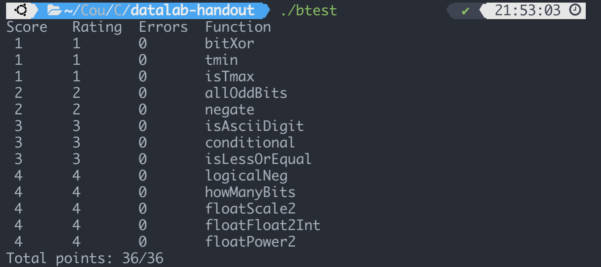
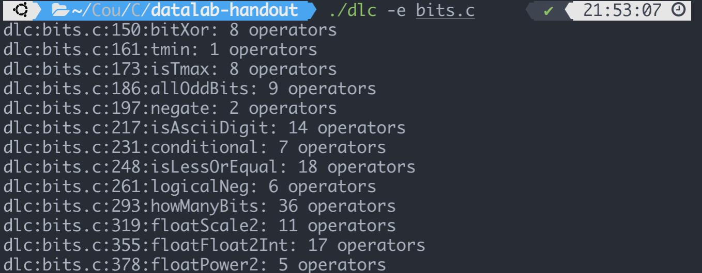

# Datalab Report

## 配置实验环境

用的主力机是 M1 芯片的 Mac, 试着跑了一下 `dlc`, 发现架构不对没法跑, 改用 Ubuntu 20.04 进行实验. 实验环境:


一上来尝试用 make 编译 btest, 报错:

"fatal error: bits/libc-header-start.h: 没有那个文件或目录"

上网搜索, 得到解决方案: `apt install gcc-multilib` 以在 64 位机子上编译出 32 位程序.

之后再次 `make` 并执行, 发现可用, 环境配置完毕.

## bitXor

由于 `a ^ b = (~a & b) | (a & ~b)`

且 `a | b = ~(~a & ~b)`, 组合即可得到答案:

```cpp
int bitXor(int x, int y) { // 8 operators
	return ~(~(~x & y) & ~(x & ~y));
}
```

## tmin

容易知道, 用补码表示的最小负数最高位是 1, 其余是 0, 因此答案为

```cpp
int tmin(void) { // 1 operators
    return (1 << 31);
}
```

## isTmax

补码表示的最大数就是最高位是 0, 其余位为 1.

注意到这个数满足加一取反以后和自身相等的性质, 但是 -1 也满足, 因此需要排除 -1:

```cpp
int isTmax(int x) { // 8 operators
    return !(~(x + 1) ^ x) & !!~x;
}
```

## allOddBits

首先构造奇数位全部是 1 的数 n = *0xAAAAAAAA*, 之后作 `x & n` 看是否是 `n`:

```cpp
int allOddBits(int x) { // 9 operators
    int allOdd = 0xAA + (0xAA << 8) + (0xAA << 16) + (0xAA << 24);
    return !((x & allOdd) ^ allOdd);
}
```

## negate

取反加一即可.

```cpp
int negate(int x) { // 2 operators
    return ~x + 1;
}
```

## isAsciiDigit

需要满足三个条件:

1. 大于 0
2. 减 0x30 还为正
3. 减 0x40 为负

为了使得运算符数量尽量少, 这里取三个的相反情况, 最后对它们求与再取反:

```cpp
int isAsciiDigit(int x) { // 14 operators
    int sign = 1 << 31;
    int zero = ~0x30 + 1;
    int ten = ~0x3A + 1;
    int lessThan0 = x & sign;
    int lessThanZero = (x + zero) & sign;
    int greaterThanTen = !((x + ten) & sign);
    return !(lessThan0 | lessThanZero | greaterThanTen);
}
```

## conditional

我希望最终的结果能够是下面的形式:

```cpp
return ((y & returnY) | (z & returnZ));
```

其中 `returnZ = ~returnY`, 取值为 0 或者 -1 (全 1).

那么首先把 `x` 做逻辑非, 使 `x` 只能为 0 或者 1, 之后要让它变为 0 或者全 1, 利用到 0 和 1 与 -1 相加的特点即可:

```cpp
int conditional(int x, int y, int z) { // 7 operators
    int returnY = !x + ~0;
    int returnZ = ~returnY;
    return ((y & returnY) | (z & returnZ));
}
```

## isLessOrEqual

不能简单的作 `x + ~y + 1` 或 `y + ~x + 1` 然后判断其正负, 因为尽管这在大多数情况下是 x 和 y 的差, 但在 x, y 异号时可能会出现溢出的情况, 因此我们需要分情况讨论:

1. x 负 y 正, 这时一定可以
2. x, y 同号, 此时作 `y + ~x + 1` 看其符号位是否为 0

```cpp
int isLessOrEqual(int x, int y) { // 18 operators
    int signOfX = (x >> 31) & 1;
    int signOfY = (y >> 31) & 1;
    int bothNeg = signOfX & signOfY;
    int bothPos = !(signOfX | signOfY);
    int l = signOfX & !signOfY;
    int difference = y + ~x + 1;
    return l | ((bothNeg | bothPos) & !((difference >> 31) & 1));
}
```

## logicalNeg

考察 0 与非 0 数不同的点, 因为补码表示的数中, 只有 0 和最小的负数相反数是本身, 因此我们可以利用 0 是唯一一个相反数和自身一样符号位都是 0 的数. 只要将它们作或运算, 取出符号位, 再与 1 作异或即可.

```cpp
int logicalNeg(int x) { // 6 operators
    return (((x | (~x + 1)) >> 31) & 1) ^ 1;
}
```

## howManyBits

通过样例可以观察到, 就是要求满足 $2^n \ge x$ 的最小的 $n$. 注意到这里正负是不一样的, 因为负数会进行符号位拓展, 因此需要先把负数转成正数:

```c
int sign = x >> 31;
x = (sign & ~x) | (~sign & x);
```

这里就把负数前面的一连串 1 全部去掉, 然后把后面那个 0 转成了 1. 这样无论对于正负数, 我们只要求出转换后 `x` 的最高位, 再把结果加一 (加上符号位) 即可.

因为 $n$ 最大只可能是 31, 因此我们不妨设 $n = b_5b_4b_3b_2b_1b_0$, 求 $n$ 的方法就是依次从高到低试探各个位 ($b_i$) 是否为 1, 如果为 1, 那么不等式两边同时除以 $2^i$, 继续求满足 $2^{b_{i-1}b_{i-2}...}\ge (x >> i)$ 的最小数:

```c
int howManyBits(int x) { // 36 operations
    int b5, b4, b3, b2, b1, b0;
    int sign = x >> 31;
    x = (sign & ~x) | (~sign & x);

    b5 = !!(x >> 16) << 4;
    x >>= b5;
    b4 = !!(x >> 8) << 3;
    x >>= b4;
    b3 = !!(x >> 4) << 2;
    x >>= b3;
    b2 = !!(x >> 2) << 1;
    x >>= b2;
    b1 = !!(x >> 1);
    x >>= b1;
    b0 = x;
    return b5 + b4 + b3 + b2 + b1 + b0 + 1;
}
```

## floatScale2

IEEE 浮点数表示为 1 位符号位 (`sign`) + 8 位阶码 (`exp`) + 23 位小数 (`frac`)

1. `exp != 0` 且 `exp != 255`

   此时 `uf * 2` 相当于指数加一

2. `exp == 0`, $uf = frac * 2^{-126}$

   这时分两种情况讨论:

   如果 `frac` 的最高位不为 1, 显然我们只要让 `frac` 左移一位

   如果 `frac` 最高位为 1, 左移一位的策略依然适用, 因为最终 `sign | frac` 时, 溢出的一位实际上给了 `exp` 部分, 我们把左移后的后 23 位记作 `frac_` 那么现在的值就是 $(1 + frac_) * 2 ^   {-126}$ , 容易看出这和没有溢出 (把 `frac` 当做 24 位) 的结果是一样的.

3. `exp == 255`, 直接返回 `uf`

```c
unsigned floatScale2(unsigned uf) { // 11 operators
    int sign = uf & (1 << 31);
    int exp = uf & (0x7F800000);
    int frac = uf & (0x7FFFFF);
    if (exp == 0x7F800000) { // NaN
        return uf;
    }
    if (exp == 0) {
        frac <<= 1;
        return sign | frac;
    }
    return sign | (exp + 0x800000) | frac;
}
```

## floatFloat2Int

浮点数转整数是直接向下取整的, 这里首先讨论指数的取值范围:

指数小于等于 127 + 30 时, $|f| = 1.frac * 2 ^ {exp} < 2^{exp + 1} <= 2^{31}$

一定满足条件, 但大于 30 时一定不可, 因为 $2^{31}$ 已结超过正数的表示范围, 而 $-2^{31}$ 恰好是最小的负数, 而题目很贴心的设置了它为 out of range 的返回值, 因此我们可以认为它也是超出范围的.

同时, 指数小于 127 + 0 时, $|f| < 1$, 可以直接四舍五入为 0, 因此指数为 0 和 255 的特殊情况可以不予考虑.

于是指数 `exp` 落在 [127, 127 + 30] 的范围内时, 我们只要让 1.frac 左移 `exp` 位即可, 在 `exp` 小于 23 时, 依然有部分小数位, 通过右移抹去即可.

```c
int floatFloat2Int(unsigned uf) { // 17 operators
    int sign = uf & (1 << 31);
    int exp = uf & (0x7F800000);
    int frac = uf & (0x7FFFFF);
    frac |= 0x800000; // 补上前面的 1
    exp >>= 23;
    if (exp > 0x9d) {
        return 0x80000000u;
    }
    if (exp < 127) {
        return 0;
    }
    exp -= 127;
    if (exp > 23) {
        frac <<= (exp - 23);
    } else { // 相当于抹去小数位
        frac >>= (23 - exp);
    }
    if (!sign) {
        return frac;
    }
    return ~frac + 1;
}
```

## floatPower2

IEEE 单精度规格化浮点数指数的表示范围是 -126~127, 判断 `x` 是否在范围内即可:

```c
unsigned floatPower2(int x) { // 5 operators
    if (x < -126) {
        return 0;
    } else if (x > 127) {
        return 0x7F800000;
    } else {
        return (x + 127) << 23;
    }
}
```

最后附完整测试截图:



